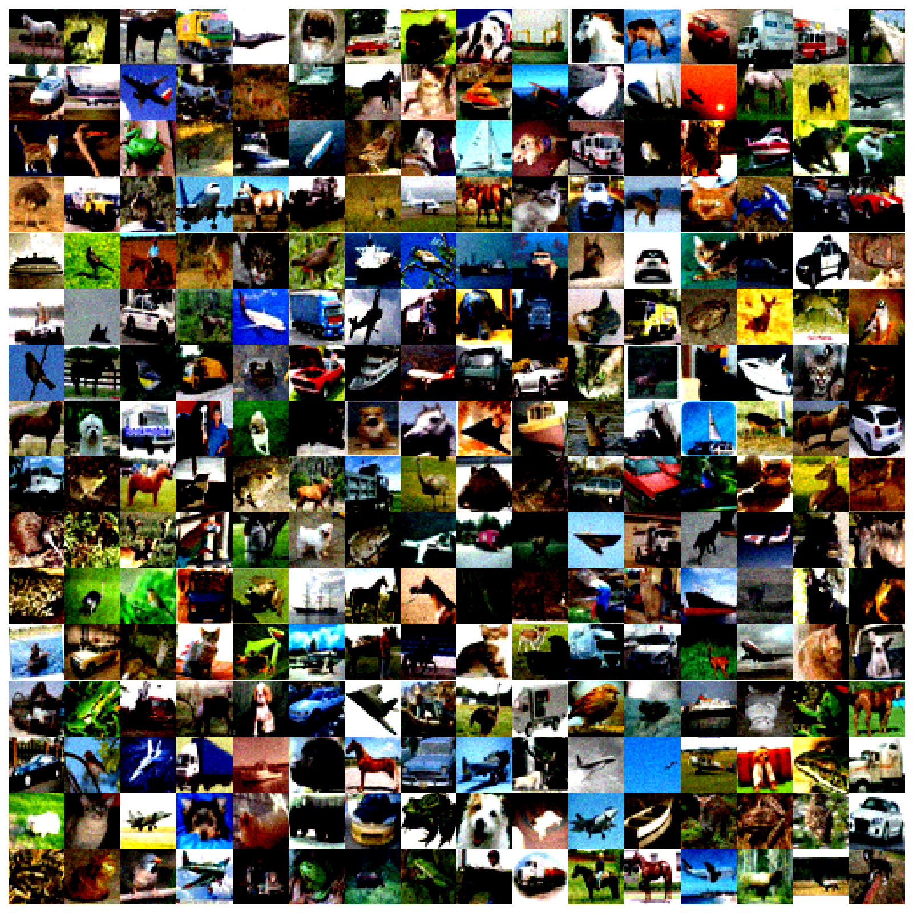

# 🌀 DDPM from Scratch on CIFAR-10

## Introduction

This project implements a **Denoising Diffusion Probabilistic Model (DDPM)** from scratch using **PyTorch**, trained on the **CIFAR-10** image dataset. DDPMs are a powerful class of generative models that learn to generate high-quality images by reversing a gradual noising process. 

The implementation focuses on clarity and modularity, making it easier to understand the inner workings of diffusion models. A custom **UNet architecture** is used as the backbone denoising network, enhanced with **residual blocks** and **timestep embeddings** to condition the model on the diffusion process.

This project serves both as a practical tool for image generation and an educational resource for learning diffusion models in deep generative modeling.


## Contents
- [Training Model from Scratch](#training-model-from-scratch)
- [Model Architecture](#model-architecture)
- [Results Obtained](#results-obtained)
    - [Generated Images](#generated-images)
    - [Parameters Used](#parameters-used)
- [License](#license)
- [Get in touch](#get-in-touch)

## 📚 Dataset: CIFAR-10

This project uses the **CIFAR-10** dataset, a widely-used benchmark for image classification and generative modeling tasks.

CIFAR-10 consists of:

- **60,000** color images with a resolution of **32×32 pixels**
- **10 classes**: airplane, automobile, bird, cat, deer, dog, frog, horse, ship, and truck
- **50,000** images for training and **10,000** for testing

Despite its small resolution, CIFAR-10 provides a diverse set of natural image categories, making it a suitable dataset for experimenting with diffusion models. Its manageable size also allows for faster experimentation and prototyping of generative architectures.

## 🧠 Background: Denoising Diffusion Probabilistic Models (DDPM)

**Denoising Diffusion Probabilistic Models (DDPM)**, introduced by *Ho et al., 2020*, are a class of generative models that produce data by simulating the reverse of a gradual noising process.

The process consists of two main stages:

### 1. Forward Process (Diffusion)
A clean image is progressively corrupted by adding Gaussian noise over a fixed number of timesteps (typically 1000). At each step, the image becomes more like pure noise.

### 2. Reverse Process (Denoising)
A neural network is trained to predict and remove the noise added at each step. During sampling, the model starts from random noise and applies the learned denoising steps in reverse order to generate a clean image.

The objective is to train the model to estimate the noise component at each step, allowing it to reverse the corruption and recover the original data distribution.

> 📄 Reference: [Denoising Diffusion Probabilistic Models (Ho et al., 2020)](https://arxiv.org/abs/2006.11239)

DDPMs have become a foundational approach in generative modeling due to their ability to produce high-quality, diverse samples — rivaling GANs, but with more stable training.

## 🏗️ Model Architecture

The denoising network used in this project is a custom **UNet**-style architecture designed to process noisy images and predict the noise added at each timestep. The model incorporates **residual connections** and **timestep embeddings** to improve learning and enable time conditioning.

### 🔧 Building Blocks


#### 🔹 Residual Block
A skip-connected module to preserve information and improve gradient flow:

GroupNorm → ReLU → Dropout → Conv2d 

#### 🔹 Down Block
Used for spatial downsampling in the encoder:

Conv2d(kernel_size=4, stride=2, padding=1)

#### 🔹 Up Block
Used for upsampling in the decoder:

ConvTranspose2d(kernel_size=4, stride=2, padding=1)

#### 🔹 Attention Block
Uses attention for layers with image sizes 4x4 and 8x8:


---

### 🧬 Network Structure

The UNet follows a typical encoder–decoder layout:

#### ➤ Encoder Side (Downsampling Path)
Each level consists of:

ResidualBlock → AttentionBlock → ResidualBlock → DownBlock

#### ➤ Bottleneck
Consists of:

ResidualBlock → AttentionBlock → ResidualBlock → AttentionBlock

#### ➤ Decoder Side (Upsampling Path)
Each level consists of:

UpBlock → ResidualBlock → AttentionBlock → ResidualBlock → AttentionBlock

---

### 🕒 Timestep Embeddings

To condition the network on the current diffusion timestep, sinusoidal time embeddings are computed and injected into the **ResidualBlock** modules. This enables the network to adapt its operations depending on the noise level present at each step.

---


## Training Model from Scratch
To train the model, run following command for example

```Python
python main.py --train --time-steps 1000 --total-steps 500000 --warmup-steps 5000 --logging-steps 1000 --checkpoint 50000 --batch-size 128 --nf 128 --lr 1e-4 --lr-schedule step --steplr-steps 50000 --steplr-factor 0.5 --save-model ddpm
```

+ --time-steps: Diffusion steps
+ --total-steps: Total training steps
+ --lr: Peak learning rate
+ --batch-size: Training batch size

Check ```python main.py -h``` for all the options.


## Results Obtained
### Generated Images

Samples generated after training the model for 600,000 steps on CIFAR-10. The images are still noisy and need more training to clear up the noise.



### Parameters Used
+ Optimizer used: Lion by Google Deepmind. (converges faster than Adam)
+ Batch size: 512
+ Training steps: 1,000,000
+ Warmup steps: 5000
+ Automatic mixed precision: False
+ Dropout: 0.1
+ Peak Learning Rate: 1e-05
+ Learning Rate schedule: constant
+ No. of base channels (nf): 32
+ No. of diffusion time steps: 1000
+ Time embedding dimension: 512
+ Beta start: 0.0001
+ Beta end: 0.02


## License
[](https://choosealicense.com/licenses/mit/)

## Get in touch
[](mailto:navintiwari08@gmail.com)
[](https://www.linkedin.com/in/navti/)

[Back To The Top](#Deep-Convolutional-GAN-with-Pytorch-and-CIFAR-10)