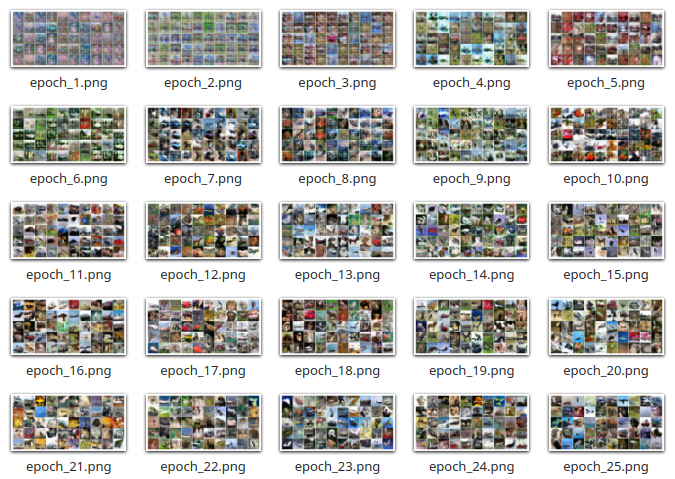
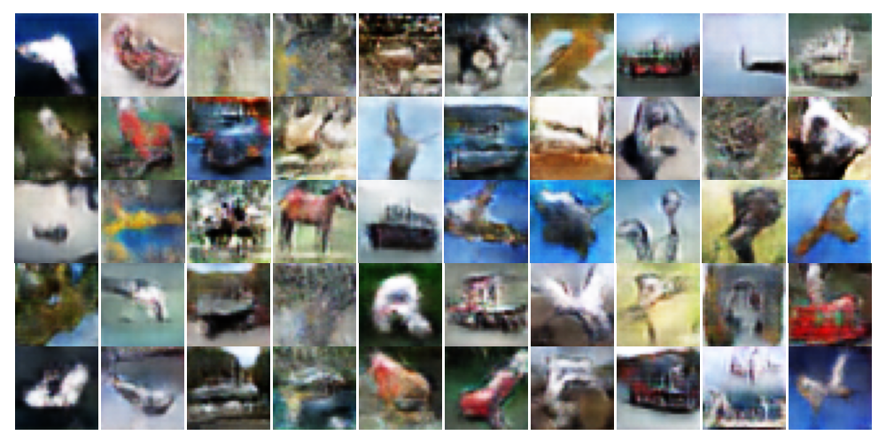
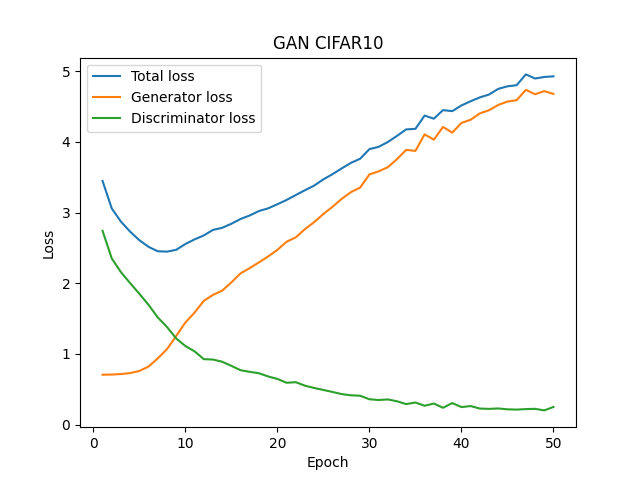

# Deep Convolutional GAN with Pytorch and CIFAR 10

This repository contains code of DCGAN which is tested and trained on CIFAR-10 dataset. It is based on Pytorch framework.


## Generative Adversarial Networks
GANs are generally made up of two models: The Artist (Generator) and The Critic (Discriminator). The generator creates an image from random noise, and the discriminator evaluates the generated image with the images in the given dataset. We train the models by minimaxing the costs of the models. The generator tries to fool the discriminator by producing realistic looking images, and the discriminator becomes better in understanding the difference between real and fake images. This two player game improves the model until the generator produces realistic images or the system reaches nash equilibrium.

## Contents
- [Training Model from Scratch](#training-model-from-scratch)
- [Model Architecture](#model-architecture)
- [Results Obtained](#results-obtained)
    - [Generated Images](#generated-images)
    - [Parameters Used](#parameters-used)
    - [Loss Curves](#loss-curves)
- [License](#license)
- [Get in touch](#get-in-touch)


## Training Model from Scratch
To train the model, run

```Python
python main.py --epochs 50 --d-lr 2e-4 --gen-lr 3e-4 --latent-dim 128 --batch-size 128 --save-model
```

+ --d-lr is the descrimintor learning rate.
+ --gen-lr is the generator learning rate.
+ --latent-dim is the latent noise vector dimension.
+ --save-model option will save the model after training.

## Model Architecture
### Generator Model
+ The generator part of the model consists of six up convolution blocks.
+ Each up convolution block contains a transposed convolution, an activation layer and a batch normalization layer.
+ The activation and batch norm layers can be enabled/disabled in code if you choose to change the architecture. 
+ The input to this generator is a noise vector with dimension latent_dim.
+ The output of generator block is a 3 channel image of size 32x32.

### Discriminator Model
+ The discriminator part of the model consists of seven Conv blocks.
+ Each convolution block contains a strided convolution layer with padding, an activation layer and a batch normalization layer.
+ The activation and batch norm layers can be enabled/disabled in code if you choose to change the architecture. 
+ The last but one layer is a classification layer used to classify the images in the given 10 classes. This classification loss is also used to train the discriminator.
+ The last layer outputs a single scalar probability of the input image being fake:0 or real:1.

## Results Obtained
### Generated Images

Samples generated after training model for 25 epochs on CIFAR-10.



Closer look at one of the samples.



### Parameters Used
+ Optimizer used is Adam
+ Learning rate for generator 0.0003, beta-1 0.5
+ Learning rate for discriminator 0.0002, beta-1 0.5
+ Batch size: 128
+ Epochs: 50
+ Latent dimension: 128

### Loss Curves

#### CIFAR-10 generator and discriminator losses:



As seen above, it's evident that keeping a stable training for GAN is difficult. The generator loss can be seen increasing. In fact, the loss shoots up after 50 epochs and the generated images turn bad. Different learning rates, label smoothing, adding noise to input data fed to discriminator are some techniques used to obtain a stable training for GAN.

## License
[](https://choosealicense.com/licenses/mit/)

## Get in touch
[](mailto:navintiwari08@gmail.com)
[](https://www.linkedin.com/in/navti/)

[Back To The Top](#Deep-Convolutional-GAN-with-Pytorch-and-CIFAR-10)