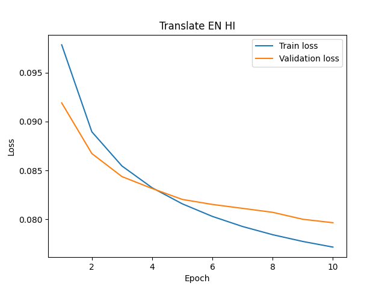
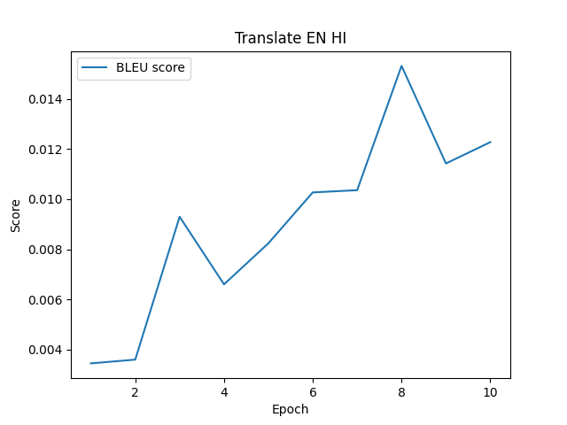

# Attention is all you need: A Pytorch Implementation

This is a PyTorch implementation of the Transformer model in "[Attention is All You Need](https://arxiv.org/abs/1706.03762)" (Ashish Vaswani, Noam Shazeer, Niki Parmar, Jakob Uszkoreit, Llion Jones, Aidan N. Gomez, Lukasz Kaiser, Illia Polosukhin, arxiv, 2017). 


A novel sequence to sequence framework utilizes the **self-attention mechanism**, instead of Convolution operation or Recurrent structure.


<p align="center">

</p>

This project has three major components.
* Implements transformer model from scratch.
* Implements a Byte Pair Encoder tokenizer.
* Trains a Translator model for English to Hindi translation task.

This project implements a byte pair encoding tokenizer which is used to train English and Hindi tokenizers using a translation data set.

The IITB English Hindi translation dataset can be obtained from [here](https://huggingface.co/datasets/cfilt/iitb-english-hindi). It should be converted to csv with columns "english" and "hindi" containing sentences in those languages. This csv file can then directly be used to train the BPE tokenizer.

The translator model builds on the transformer model with an additional linear layer to map predictions to the vocabulary size in Hindi on the decoder side. The model is trained only for 10 epochs due to resource constraints, and hence the quality of translation is not great but decent for a proof of concept.

### Model Specification

* total parameters = 36 M
* model size = 138 MB

### configuration

* batch_size = 64
* max_len = 32
* d_model = 512
* n_layers = 6
* n_heads = 8
* lr = 5e-5
* epoch = 10
<br><br>

# Usage

## Train BPE tokenizer

Run following commands to train the BPE tokenizer:
```python
cd bpe
python tokenizer.py
```

The english and hindi tokenizers are saved in **bpe/saved** directory.

## Train the translator model

Run following command to train the model

```python
python main.py --train --save-model --nenc 6 --ndec 6 --dmodel 512 --epochs 10 --lr 5e-5
```

The model can be trained with different configurations. To view what command line options are available, use command:

```python
python main.py -h
```

Trained model is saved in **model/saved_models** directory.

A saved model can also be loaded and trained from thereon. Use --load option and provide the model path that you want to load and continue training on.

## Run inference

To run inference, just run

```python
python main.py --load <model_path>
```
Make sure the model parameters set in main.py are same as what the model was trained with. If not, you can provide custom parameters while loading the model.

```python
python main.py --load <model_path> --nenc 6 --ndec 6 --dmodel 128
```

# Results
## Training
Training Parameters:
- num encoders: 6
- num decoders: 6
- model dimension: 512
- learning rate: 5e-5
- num of epochs: 10
- optimizer: AdamW
<br><br>

The following losses and BLEU scores were obtained. As can be seen, the model was trained only for 10 epochs, the resuls look okay but can significantly improve if trained longer.

<p align="center">


</p>
 
  
## Inference
Here are some translations of given English sentences.

```
Enter an English sentence.
EN: What is your name?
HI: आपका नाम क्या है? 

Enter an English sentence.
EN: Where are you going?
HI: तुम कहाँ जा रहे हो? 

Enter an English sentence.
EN: The student secured first rank in the college.
HI: कॉलेज कालेज में प्रथम छात्रवृत्तियां प्राप्त हुई। 

Enter an English sentence.
EN: We can meet at the bus stop and then proceed from there.
HI: हम बस वहां बैठकर वहां बैठ कर बैठ सकते हैं और फिर वहां से आगे बढ़ सकते हैं। 

Enter an English sentence.
EN: Please open this box.
HI: कृपया इस बक्से को खोलें। 

Enter an English sentence.
EN: Can you help me?
HI: क्या तुम मेरी मदद कर सकते हो? 

Enter an English sentence.
EN: She sings quite beautifully!
HI: वह खूब खूबसूरती से सुंदर सुंदर है। 

Enter an English sentence.
EN: This needs more training.
HI: इससे अधिक प्रशिक्षण की आवश्यकता होती है। 

Enter an English sentence.
EN: Ok. Goodbye!
HI: ठीक है... 
```
---
# TODO
  - Evaluation on the generated text.
  - Train the model for longer to improve performance.
  - Try different training parameters like a higher learning rate and a longer context length.
---
