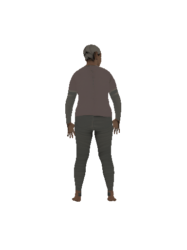
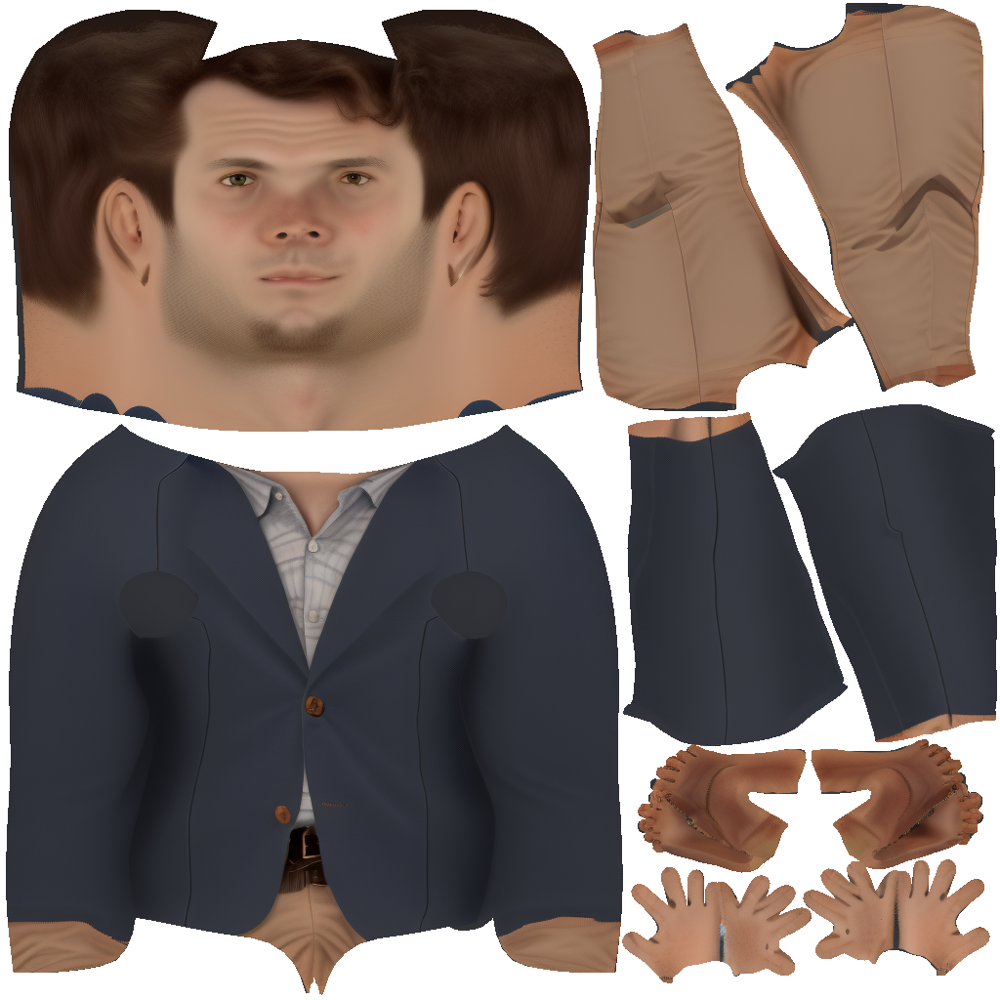

# TexDreamer (Joint T2UV + I2UV Training)

TexDreamer is a two-stage diffusion-based framework for generating UV texture maps of 3D human models from either text, image, or both. This repository contains a reimplementation with support for **joint training** of both text-to-UV (T2UV) and image-to-UV (I2UV) tasks.

---

## 🧠 What is TexDreamer?

TexDreamer is a two-stage generative model for UV texture synthesis conditioned on either text prompts or images:

* **T2UV (Text-to-UV):** Given a textual description of a person (e.g. "a man wearing a red jacket"), the model generates a UV texture.
* **I2UV (Image-to-UV):** Given a rendered or real RGB image, the model generates a corresponding UV texture.
* **Joint Training:** Our implementation allows training both T2UV and I2UV in a unified framework, using a shared UNet and LoRA adapters. This is more efficient and enables multitask learning.

---

## 📁 Project Structure

```
├── config/
│   └── train_config.yaml         # Training hyperparameters
├── lora_utils.py                 # LoRA integration and utilities
├── i2uv.py                       # I2UV-only training
├── t2uv.py                       # T2UV-only training
├── joint.py                      # Joint training (T2UV + I2UV)
├── infer_uv.py                   # Inference from text, image, or both
├── atlas_dataset/                # Custom dataset wrapper
│   └── dataset.py
│   └── build_atlas_large.py
├── render/                       # Custom dataset wrapper
│   └── utils.py
│   └── render_turntable.py
└── checkpoints/                  # Saved LoRA weights and aligner states
```

---

## ⚙️ Setup Instructions

```bash
# Clone the repo
$ git clone https://github.com/navti/MLProjects.git
$ cd texdreamer

# Install dependencies
$ pip install -r requirements.txt

# Login to Hugging Face if needed
$ huggingface-cli login
```

---

## 🧾 Dataset (atlas-large)

This project uses a **custom dataset** derived from the ATLAS dataset and SMPL-based rendered views. The dataset includes:

* UV texture maps of size **1024×1024**
* Rendered RGB images of size **1024×768**
* Corresponding **text prompts**

The dataset contains approximately **259,000 samples** and occupies around **450 GB** of storage. It will be released on Hugging Face under the user profile [`navintiwari`](https://huggingface.co/navintiwari).

The dataset was created using the `atlas_dataset/build_atlas_large.py` script.

The `atlas_dataset/dataset.py` script contains two classes derived from the pytorch dataset class. One for building this custom dataset which uses the original ATLAS dataset from the paper's author and another to perform joint training.

---

## 🚀 Training

### Text-to-UV Training (not used)

```bash
python t2uv.py
```

### Image-to-UV Training (not used)

```bash
python i2uv.py
```

### Joint T2UV + I2UV Training (used in this repo)

```bash
python joint.py
```

All training configs are located in `config/train_config.yaml`.

---

## 🔍 Inference

Run inference from text, image, or both:

```bash
python infer_uv.py --prompt "a woman in a yellow dress"
python infer_uv.py --image path/to/input.png
```

Output UV texture will be saved to `outputs/`.

---

## 🎨 Results Gallery (Samples)

This section will contain examples of input prompts, generated UV textures, and turntable-rendered GIFs of the resulting 3D human models.

| Prompt                        | Generated UV Texture | Rendered Turntable GIF      |
| ----------------------------- | -------------------- | --------------------------- |
| "An elderly woman with white hair, in pink sweater and striped jeans"   |  |  |
| "A Middle Eastern, young boy with short auburn hair wearing gray shirt and green pants"   |  |  |
| "A white man with brown hair wearing blue blazer and khaki pants"   |  |  |
| "Elder woman with floral jacket wearing gray pants and has auburn hair"   |  |  |
| "A mixed race elder man with white hair, wearing gray shirt and khaki shorts"   |  |  |

---

## 🔬 Differences From Original TexDreamer Paper

| Feature           | Original Paper       | This Implementation               |
| ----------------- | -------------------- | --------------------------------- |
| Training Strategy | Two-stage separately | **Joint training** (single model) |
| Parameter Sharing | Separate UNets       | **Shared UNet** with LoRA         |
| LoRA Fine-tuning  | Not explicitly used  | **LoRA applied to UNet**          |
| Dataset           | Internal/ATLAS-S     | Custom ATLAS + SMPL               |
| Flexibility       | Text **or** image    | **Text, image, or both**          |
| Inference Inputs  | Single modality      | Mixed-modal inputs supported      |

---

## 📊 Logging & Metrics

* Logging is handled via **TensorBoard**
* Launch with:

```bash
tensorboard --logdir=logs
```

* Recommended metrics:

  * `loss/t2uv`: Text-to-UV diffusion loss
  * `loss/i2uv`: Image-to-UV diffusion loss
  * `loss/combined`: Weighted joint loss

---

## 🧠 Tips

* Ideal learning rate: `1e-4` with LoRA and AdamW
* Enable `xformers` and gradient checkpointing for memory savings
* Adjust LoRA rank and alpha to control capacity

---

## 🧾 Acknowledgements

* [TexDreamer (CVPR 2024)](https://arxiv.org/abs/2403.11393)
* [Diffusers by Hugging Face](https://github.com/huggingface/diffusers)
* [ATLAS Dataset](https://github.com/nkolot/atlas)
* [PEFT + LoRA](https://github.com/huggingface/peft)

---

## 📌 Future Work

* Integrate DreamBooth-style personalization
* Add evaluation with FID, LPIPS, UV texture consistency
* Explore dynamic image resolutions for I2UV

---
